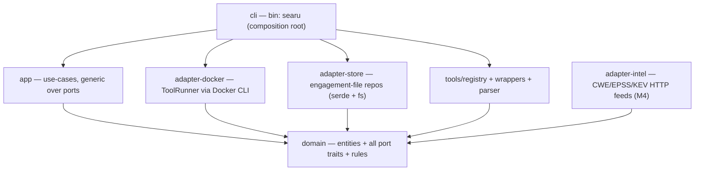
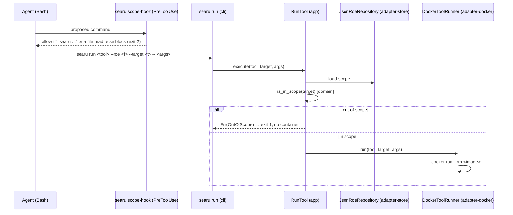

# Searu architecture

Searu is a single cross-platform Rust binary (`searu`) that drives containerised security tools for
authorised engagements. Every scanner runs in Docker; the binary itself has zero runtime
dependencies. It installs into `~/.claude` as a self-contained, cloneable payload (the gstack model)
and keeps mutable state out of `~/.claude`.

## Crate layering — hexagonal / ports-and-adapters

Dependencies point inward only. `domain` depends on nothing; `app` and every adapter depend on
`domain` alone; `cli` is the sole composition root. The rule is enforced by the compiler: a crate
can only use what its `Cargo.toml` declares, so `domain` physically cannot reach for Docker or the
filesystem, and no adapter can reach for another.

| Crate | Role | Depends on | Knows about |
| --- | --- | --- | --- |
| `domain` | Entities, rules (`is_host_in_scope`, ROE model, findings, techniques, exploit-gate `Decision`) and **all port traits** (`RoeRepository`, `ToolRunner`, `FindingsStore`, `LootStore`, `ObservationStore`, `WordlistProvider`, `ToolRegistry`) | nothing | nothing external |
| `app` | Use-cases generic over the ports: shipped `RunAction`, `QueryFindings`, `QueryLoot`, `QueryObservations`, `ValidateRoe`; planned `EmitFinding`, `Report` | `domain` | no I/O, no Docker |
| `adapter-docker` | `DockerToolRunner`: builds a tool crate's embedded `Dockerfile` and runs it via the Docker CLI | `domain` | Docker |
| `adapter-store` | `JsonRoeRepository` + the findings / loot / observations JSONL stores | `domain` | serde, filesystem |
| `tools/*` | `tools/parser` (normalisation helpers), `tools/registry` (the `ToolRegistry`), and one wrapper crate per tool implementing `Tool` | `domain` | the tool's own output format |
| `adapter-intel` | HTTP clients for the CWE/EPSS/KEV feeds (M4, not yet built) | `domain` | HTTP |
| `cli` | Parses args (clap), constructs concrete adapters, injects them into the generic use-cases | `app`, adapters | everything, at the edge |

Dependency injection is via **generics** (`RunTool<R: RoeRepository, T: ToolRunner>`), not `dyn`.
Use-cases are tested with **hand-written fakes** implementing the port traits — no I/O, no Docker,
no mocking framework. This is what makes the toolkit's most important safety property testable in
milliseconds: *an out-of-scope target must never launch a container.*

## Scope enforcement

Scope is a domain rule, not a command. There is no `check-scope` subcommand.

- **Primary gate — inside `searu run`.** The `RunTool` use-case loads the ROE, calls
  `domain::is_in_scope`, and refuses an out-of-scope target with a hard error before the runner is
  ever invoked. Precedence: default-deny (a host matching no target is out), domain-suffix and CIDR
  matching, and an exclusion overridden only by an *exact* target entry for that host.
- **Backstop — the PreToolUse hook plus a project egress deny-list.** `searu scope-hook` (shipped,
  wired into the `/searu` `SKILL.md` `hooks.PreToolUse` with matcher `*`) forces a target-facing agent
  through `searu`: `domain::scope_hook::decide` is **default-deny** — a shell call (`Bash` or, on
  Windows, `PowerShell`/`pwsh`) must be `searu …`, a small allow-set of local tools
  (`Read`/`Write`/`Edit`/`Grep`/`Glob`/`Agent`/`Task`/`TodoWrite`/`NotebookEdit`, the background-shell
  tools `BashOutput`/`KillShell`/`KillBash`, plus the UI/planning cohort
  `AskUserQuestion`/`ExitPlanMode`/`EnterPlanMode`/`ScheduleWakeup`/`Task*`) passes, and every
  network-capable tool (`WebFetch`/`WebSearch`/`Skill`/`mcp__*`) is blocked with exit 2. On the allow path the hook now emits
  `hookSpecificOutput.permissionDecision:"allow"` so the sanctioned action is auto-approved rather than
  re-prompted — one approval authority, no per-call prompt fatigue. It does not read the ROE; its sole
  job is to prevent bypass so scope always flows through `searu run`. Because Claude Code does **not** reliably enforce frontmatter
  tool-restrictions (skill `allowed-tools` or subagent `tools:`), and a **skill-frontmatter hook does
  not reach an Agent-spawned specialist** (field-verified: a specialist's raw `docker run` slipped the
  `SKILL.md` hook), `searu harden` writes the enforcement into a project-scoped `.claude/settings.json`
  instead — a settings-level `hooks.PreToolUse` running `searu scope-hook` (the propagating home for the
  allowlist), plus `permissions.deny` covering the egress tools (`WebFetch`/`WebSearch`/`mcp__*`) **and**
  the target-reaching Bash programs a specialist must never call directly (`Bash(docker:*)`/`curl`/`wget`/
  `nc`/`ncat`/`socat`). The `SKILL.md` `allowed-tools` line is advisory only. See
  *product-plan.md → Resolved design decisions* (1).

## Planned: the asset model & sessions (M6–M7)

Two milestones extend the domain without breaking the layering (see `product-plan.md` for the full
design). Everything below is **planned, not built**.

- **New domain types (M6).** `Host` (an opaque identity derived from a stable fingerprint — SSH
  host-key / TLS-SPKI / `machine-id` / product-uuid / MACs / hostname, in that priority — never an
  IP), `Address { network, value }`, `Network` (`internet` | `behind:<host>`, the vantage/pivot
  graph), `Service { host, port, protocol, product }`, and `Foothold { host, service, shell_kind,
  obtained_via }`. `Finding`/`Loot`/`Observation` gain the attribution tuple `(host, service,
  network, tool, technique)`; credential `Loot` gains `principal` + `authenticates`. `Tool::parse`
  gains the run's `technique` so wrappers label records correctly and turn command output into
  observations. Host identity carries a review invariant — **correlation may never expand scope**: a
  merge that would pull a new address into scope stays a *candidate* until the operator confirms, and
  shared-by-construction claims (TLS-SPKI) rank *below* per-host claims (`machine-id` / SSH host-key).
  Scope also generalises — `ScopeEntry` becomes a matcher sum type adding **URL-prefix** subtree
  scoping alongside host/CIDR, default-deny / most-specific-wins preserved.
- **Network-aware gate (M6).** `gate::decide` keeps scope-absolute → exact-ATT&CK-id → tier, but
  scope resolution takes `(address, network)`, matches per network, and for a non-`internet` network
  additionally requires a foothold providing reachability and `T1021` allow-listed. Candidates are
  never auto-promoted. Two review decisions extend the gate: the ROE gains **gate-enforced
  operational limits** — `windows`, a per-technique `rate` ceiling, and `stop_after` / blast-radius —
  adding `Decision::OutOfWindow` and `Decision::RateExceeded` (the clock stamped in the adapter so
  `domain` stays clock-free, the rate ceiling threaded to the runner); and an **unknown / untiered
  technique fails closed** (refuse-with-explanation) rather than defaulting to the Exploitation tier.
- **Session subsystem (M7).** A new `SessionBroker` port (`open_listener`/`exec`/`close`) with a new
  **`adapter-session`** crate (`cli → adapter-session → domain`) running a per-session **broker
  container** that owns the channel and bundles the redirector tooling (socat/ncat + ngrok/cloudflared
  /ssh `-R`). `app` use-cases `OpenSession`/`ExecInSession`/`CloseSession` are gated by `gate::decide`
  exactly like `RunAction`; the CLI adds `searu session …`. The one-shot-CLI + everything-in-a-container
  model is preserved (state lives in a `./pentest/` registry + the broker container), and the crate
  layering rule (`domain` depends on nothing; adapters on `domain` only; `cli` the composition root)
  is unchanged.
- **Storage (M6).** The append-only JSONL under `./pentest/` stays the **source of truth**; the
  graph is a **derived, in-memory `petgraph` projection** built per query (a compiled-in library, no
  service, no file-format change) — a networked graph DB is rejected, an embedded store is a
  future-only option. `adapter-store` emit becomes an **upsert**: dedup on record identity (content
  minus timestamps), stamping `first_seen`/`last_seen` at the adapter (domain stays clock-free). The
  dedup identity includes the host, so `Loot`/`Observation` gain a `host` (loot keys on
  `(fingerprint, host)`). A fourth store is already shipped: an append-only **`./pentest/audit.jsonl`**
  to which `RunAction` writes every gate decision — authorised *and* refused, with the tool, technique,
  target, decision and requested args — *before* the runner is invoked (an `AuditLog` port +
  `JsonlAuditLog` adapter stamping the time), the engagement's chain-of-custody record. Fail-closed.
- **Container privileged escape hatch (M8).** Raw-socket work (nmap SYN / OS-detection) that Docker
  Desktop's VM on Windows/macOS cannot serve runs with elevated caps (`--cap-add` / `--net=host`) on
  native Linux, gated identically to every other run — the container invariant keeps a documented,
  authorised exception rather than silently dropping the capability.

## Distribution and install

- **Shipped today (binary).** `install.sh` (macOS/Linux/Git-Bash/WSL) and `install.ps1` (Windows
  PowerShell) download a prebuilt `searu` binary from GitHub Releases per OS/arch and put it on PATH
  (`~/.local/bin` on Unix, `%LOCALAPPDATA%\Programs\searu` + user PATH on Windows), falling back to
  `cargo install --git … searu --locked` when no platform asset is published and a Rust toolchain is
  present. `SEARU_BIN_DIR`/`SEARU_VERSION` override the location/release; `mise run install-local`
  builds the local checkout into `~/.cargo/bin` for development.
- **Shipped (M5) — the `/searu` skill install.** The skill payload is embedded in the `searu` binary
  at build time (`include_dir`); `searu install-skill` writes it to `~/.claude/skills/searu/`,
  rewrites the `SKILL.md` PreToolUse hook command to the binary's own absolute path, drops a
  `.searu-owned` provenance marker, and refuses to clobber a user's own same-named skill. `install.sh`,
  `install.ps1` and `mise run install-local` all call it (one cross-platform Rust path; `SEARU_NO_SKILL`
  opts out). This replaced the earlier symlink-from-checkout idea, which could not work for the
  binary-only `curl … | sh` install.
- Runtime caches (CWE/EPSS/KEV, M4) are planned to live in `~/.searu/` (`SEARU_HOME`), never in
  `~/.claude`. Engagement data stays per-project in `./pentest/`.
- Tool images are built on first use from each tool crate's embedded `Dockerfile`; pulling prebuilt
  `ghcr.io/<ns>/searu-<tool>` with a build fallback is planned.

## Toolchain and quality gates

`mise.toml` pins the Rust toolchain; `mise install` locally and `jdx/mise-action` in CI use the same
version. CI runs `cargo fmt --check`, `cargo clippy -D warnings`, and `cargo test` as separate
namespaced jobs (`check/fmt`, `check/quality`, `check/test`). Cross-platform POSIX git hooks in
`.githooks/` enforce file hygiene, the same fmt/clippy/test gates, and Conventional Commits.
