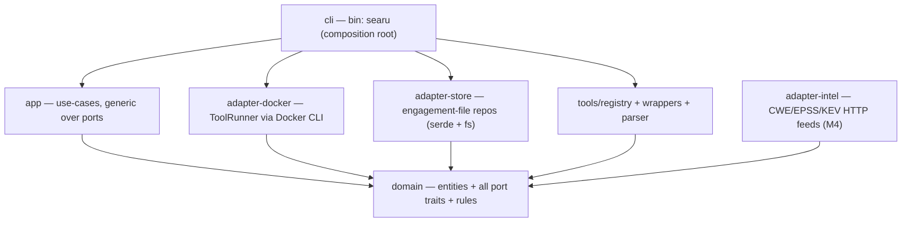
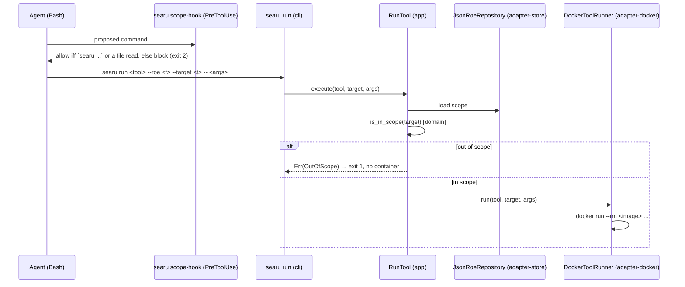

# Searu architecture

Searu is a single cross-platform Rust binary (`searu`) that drives containerised security tools for
authorised engagements. Every scanner runs in Docker; the binary itself has zero runtime
dependencies. It installs into `~/.claude` as a self-contained, cloneable payload (the gstack model)
and keeps mutable state out of `~/.claude`.

## Crate layering — hexagonal / ports-and-adapters

Dependencies point inward only. `domain` depends on nothing; `app` and every adapter depend on
`domain` alone; `cli` is the sole composition root. The rule is enforced by the compiler: a crate
can only use what its `Cargo.toml` declares, so `domain` physically cannot reach for Docker or the
filesystem, and no adapter can reach for another.

| Crate | Role | Depends on | Knows about |
| --- | --- | --- | --- |
| `domain` | Entities, rules (`is_host_in_scope`, ROE model, findings, techniques, exploit-gate `Decision`) and **all port traits** (`RoeRepository`, `ToolRunner`, `FindingsStore`, `LootStore`, `ObservationStore`, `WordlistProvider`, `ToolRegistry`) | nothing | nothing external |
| `app` | Use-cases generic over the ports: shipped `RunAction`, `QueryFindings`, `QueryLoot`, `QueryObservations`, `ValidateRoe`; planned `EmitFinding`, `Report` | `domain` | no I/O, no Docker |
| `adapter-docker` | `DockerToolRunner`: builds a tool crate's embedded `Dockerfile` and runs it via the Docker CLI | `domain` | Docker |
| `adapter-store` | `JsonRoeRepository` + the findings / loot / observations JSONL stores | `domain` | serde, filesystem |
| `tools/*` | `tools/parser` (normalisation helpers), `tools/registry` (the `ToolRegistry`), and one wrapper crate per tool implementing `Tool` | `domain` | the tool's own output format |
| `adapter-intel` | HTTP clients for the CWE/EPSS/KEV feeds (M4, not yet built) | `domain` | HTTP |
| `cli` | Parses args (clap), constructs concrete adapters, injects them into the generic use-cases | `app`, adapters | everything, at the edge |

Dependency injection is via **generics** (`RunTool<R: RoeRepository, T: ToolRunner>`), not `dyn`.
Use-cases are tested with **hand-written fakes** implementing the port traits — no I/O, no Docker,
no mocking framework. This is what makes the toolkit's most important safety property testable in
milliseconds: *an out-of-scope target must never launch a container.*

## Scope enforcement

Scope is a domain rule, not a command. There is no `check-scope` subcommand.

- **Primary gate — inside `searu run`.** The `RunTool` use-case loads the ROE, calls
  `domain::is_in_scope`, and refuses an out-of-scope target with a hard error before the runner is
  ever invoked. Precedence: default-deny (a host matching no target is out), domain-suffix and CIDR
  matching, and an exclusion overridden only by an *exact* target entry for that host.
- **Backstop — the PreToolUse allowlist hook.** `searu scope-hook` (shipped) forces a target-facing
  agent to invoke `searu` and nothing else: it reads the hook payload on stdin and, for a `Bash`
  call, allows only a `searu …` command (else exit 2); non-Bash tools such as `Read`/`Grep` pass. It
  does not read the ROE; its sole job is to prevent bypass so scope always flows through `searu run`.
  Wiring it into the `/searu` SKILL.md `hooks.PreToolUse` is the remaining M5 step.

## Planned: the asset model & sessions (M6–M7)

Two milestones extend the domain without breaking the layering (see `product-plan.md` for the full
design). Everything below is **planned, not built**.

- **New domain types (M6).** `Host` (an opaque identity derived from a stable fingerprint — SSH
  host-key / TLS-SPKI / `machine-id` / product-uuid / MACs / hostname, in that priority — never an
  IP), `Address { network, value }`, `Network` (`internet` | `behind:<host>`, the vantage/pivot
  graph), `Service { host, port, protocol, product }`, and `Foothold { host, service, shell_kind,
  obtained_via }`. `Finding`/`Loot`/`Observation` gain the attribution tuple `(host, service,
  network, tool, technique)`; credential `Loot` gains `principal` + `authenticates`. `Tool::parse`
  gains the run's `technique` so wrappers label records correctly and turn command output into
  observations.
- **Network-aware gate (M6).** `gate::decide` keeps scope-absolute → exact-ATT&CK-id → tier, but
  scope resolution takes `(address, network)`, matches per network, and for a non-`internet` network
  additionally requires a foothold providing reachability and `T1021` allow-listed. Candidates are
  never auto-promoted.
- **Session subsystem (M7).** A new `SessionBroker` port (`open_listener`/`exec`/`close`) with a new
  **`adapter-session`** crate (`cli → adapter-session → domain`) running a per-session **broker
  container** that owns the channel and bundles the redirector tooling (socat/ncat + ngrok/cloudflared
  /ssh `-R`). `app` use-cases `OpenSession`/`ExecInSession`/`CloseSession` are gated by `gate::decide`
  exactly like `RunAction`; the CLI adds `searu session …`. The one-shot-CLI + everything-in-a-container
  model is preserved (state lives in a `./pentest/` registry + the broker container), and the crate
  layering rule (`domain` depends on nothing; adapters on `domain` only; `cli` the composition root)
  is unchanged.

## Distribution and install

- **Shipped today (binary).** `install.sh` (macOS/Linux/Git-Bash/WSL) and `install.ps1` (Windows
  PowerShell) download a prebuilt `searu` binary from GitHub Releases per OS/arch and put it on PATH
  (`~/.local/bin` on Unix, `%LOCALAPPDATA%\Programs\searu` + user PATH on Windows), falling back to
  `cargo install --git … searu --locked` when no platform asset is published and a Rust toolchain is
  present. `SEARU_BIN_DIR`/`SEARU_VERSION` override the location/release; `mise run install-local`
  builds the local checkout into `~/.cargo/bin` for development.
- **Planned (M5) — the `~/.claude` pointer.** `install.sh`/`install.ps1` will additionally clone the
  self-contained payload to `~/.claude/skills/searu/` and register a single thin pointer (symlink on
  Unix, copy on Windows without Developer Mode) carrying a `.searu-owned` provenance marker, rewriting
  the SKILL.md PreToolUse hook command to the installed binary path.
- Runtime caches (CWE/EPSS/KEV, M4) are planned to live in `~/.searu/` (`SEARU_HOME`), never in
  `~/.claude`. Engagement data stays per-project in `./pentest/`.
- Tool images are built on first use from each tool crate's embedded `Dockerfile`; pulling prebuilt
  `ghcr.io/<ns>/searu-<tool>` with a build fallback is planned.

## Toolchain and quality gates

`mise.toml` pins the Rust toolchain; `mise install` locally and `jdx/mise-action` in CI use the same
version. CI runs `cargo fmt --check`, `cargo clippy -D warnings`, and `cargo test` as separate
namespaced jobs (`check/fmt`, `check/quality`, `check/test`). Cross-platform POSIX git hooks in
`.githooks/` enforce file hygiene, the same fmt/clippy/test gates, and Conventional Commits.
