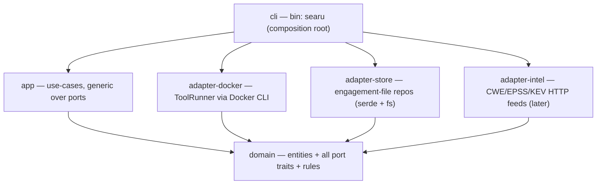
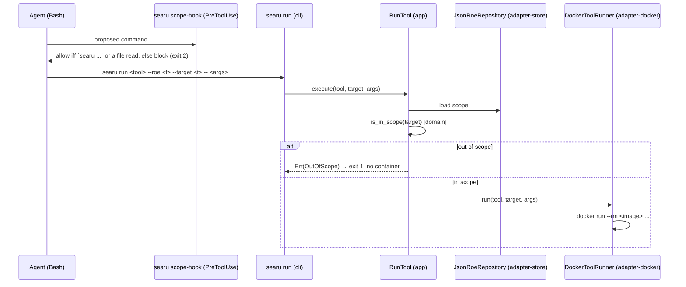

# Searu architecture

Searu is a single cross-platform Rust binary (`searu`) that drives containerised security tools for
authorised engagements. Every scanner runs in Docker; the binary itself has zero runtime
dependencies. It installs into `~/.claude` as a self-contained, cloneable payload (the gstack model)
and keeps mutable state out of `~/.claude`.

## Crate layering — hexagonal / ports-and-adapters

Dependencies point inward only. `domain` depends on nothing; `app` and every adapter depend on
`domain` alone; `cli` is the sole composition root. The rule is enforced by the compiler: a crate
can only use what its `Cargo.toml` declares, so `domain` physically cannot reach for Docker or the
filesystem, and no adapter can reach for another.

| Crate | Role | Depends on | Knows about |
| --- | --- | --- | --- |
| `domain` | Entities, rules (`is_in_scope`, ROE model, findings, techniques, exploit-gate `Decision`) and **all port traits** (`RoeRepository`, `ToolRunner`, `FindingsStore`, `LootStore`, …) | nothing | nothing external |
| `app` | Use-cases generic over the ports (`RunTool<R, T>`, `ValidateRoe`, `EmitFinding`, `Report`) | `domain` | no I/O, no Docker |
| `adapter-docker` | `DockerToolRunner`: runs a tool image via the Docker CLI | `domain` | Docker |
| `adapter-store` | `JsonRoeRepository` and (later) findings/loot repos | `domain` | serde, filesystem |
| `adapter-intel` | HTTP clients for the CWE/EPSS/KEV feeds (later slice) | `domain` | HTTP |
| `cli` | Parses args (clap), constructs concrete adapters, injects them into the generic use-cases | `app`, adapters | everything, at the edge |

Dependency injection is via **generics** (`RunTool<R: RoeRepository, T: ToolRunner>`), not `dyn`.
Use-cases are tested with **hand-written fakes** implementing the port traits — no I/O, no Docker,
no mocking framework. This is what makes the toolkit's most important safety property testable in
milliseconds: *an out-of-scope target must never launch a container.*

## Scope enforcement

Scope is a domain rule, not a command. There is no `check-scope` subcommand.

- **Primary gate — inside `searu run`.** The `RunTool` use-case loads the ROE, calls
  `domain::is_in_scope`, and refuses an out-of-scope target with a hard error before the runner is
  ever invoked. Precedence: default-deny (a host matching no target is out), domain-suffix and CIDR
  matching, and an exclusion overridden only by an *exact* target entry for that host.
- **Backstop — the PreToolUse allowlist hook.** `searu scope-hook` forces a target-facing agent to
  invoke `searu` and nothing else — no `docker`, `curl`, `wget`, or raw scanners — the only exception
  being reading files. It does not read the ROE; its sole job is to prevent bypass so scope always
  flows through `searu run`.

## Distribution and install

- The repo is a self-contained payload cloned to `~/.claude/skills/searu/`. `install.sh` /
  `install.ps1` register thin pointers into `~/.claude/{agents,skills,commands}/` (symlink on Unix,
  copy on Windows without Developer Mode) carrying `.searu-owned` provenance markers, and rewrite
  each agent's PreToolUse hook command to the installed binary path.
- Runtime state lives in `~/.searu/` (`SEARU_HOME`): the downloaded/built `searu` binary and the
  CWE/EPSS/KEV caches. Engagement data stays per-project in `./pentest/`.
- The `searu` binary is a prebuilt static download from GitHub Releases per OS/arch, falling back to
  `cargo build` when a platform asset is missing and a Rust toolchain is present.
- Tool images are pulled from `ghcr.io/<ns>/searu-<tool>` on first use, falling back to building
  from a checked-in `images/<tool>.Dockerfile` when the pull fails.

## Toolchain and quality gates

`mise.toml` pins the Rust toolchain; `mise install` locally and `jdx/mise-action` in CI use the same
version. CI runs `cargo fmt --check`, `cargo clippy -D warnings`, and `cargo test` as separate
namespaced jobs (`cli/fmt`, `cli/quality`, `cli/test`). Cross-platform POSIX git hooks in
`.githooks/` enforce file hygiene, the same fmt/clippy/test gates, and Conventional Commits.
