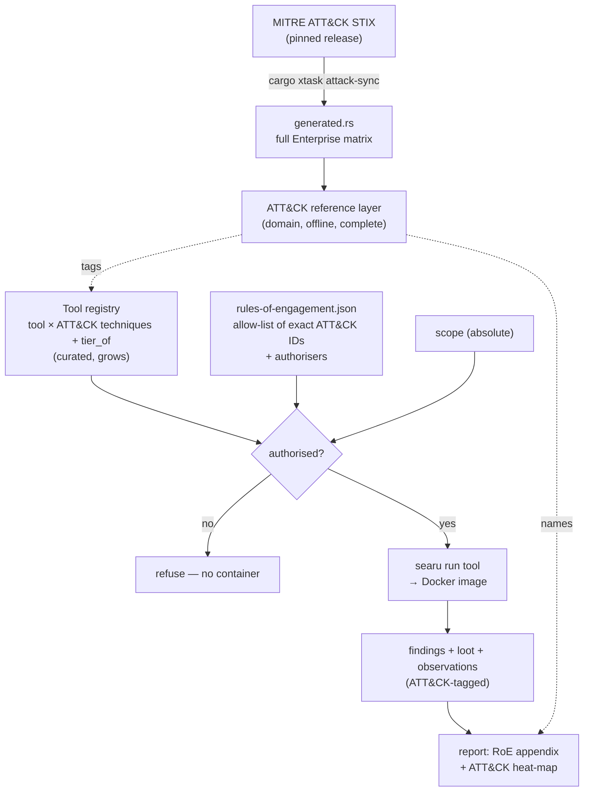
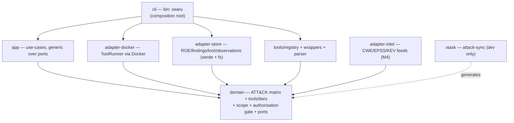
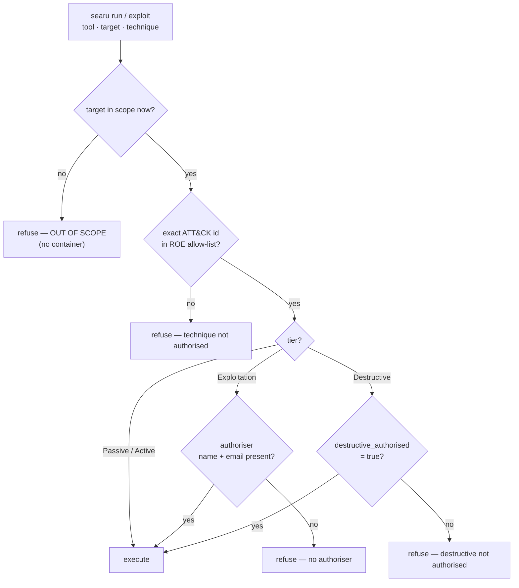

# Searu — product & design plan

An ATT&CK-driven security-assessment toolkit: one skill (`/searu`) that turns Claude Code into an
authorised pen-testing operator, organised around the **MITRE ATT&CK** framework, driving
containerised tools that can both *assess* and — with sufficient authorisation — *exploit* a target.

This is the "what & why & architecture" reference. The living ATDD slice tracker is
[current-plan.md](current-plan.md); the crate-level rules are in [architecture.md](architecture.md).

## Implemented architecture (authoritative)

Milestone 1 shipped, and it settled the tool boundary: Claude orchestrates and `searu` is gated
hands plus memory. This section is the settled model; the design discussion further down elaborates
it.

- **Claude orchestrates; searu is gated hands + memory.** searu never plans and never exploits by
  hand. For one invocation it enforces the gate, runs the authorised tool in its container,
  normalises the tool's output into findings/loot/observations, and answers queries over that state.
  Claude decides what to run next by querying findings/loot/observations.
- **One gated action:** `searu run <tool> --technique <Txxxx> --target <t> [-- <tool args>]`. The gate
  is: the tool must list that technique; the target must be in scope *now*; the exact ATT&CK ID must
  be in the ROE allow-list; and the technique's tier must be satisfied (Exploitation → a named
  authoriser; Destructive → authoriser + `destructive_authorised`). Tiers come from a curated
  `domain::technique::tier_of` table (unknown → Exploitation).
- **Queries:** `searu findings [--technique|--severity|--tool]`, `searu loot [--category] [--reveal]`,
  `searu observations [--kind]`, `searu tool list`, `searu tool advice <tool>`, `searu attack list|show`.
- **Crate-per-tool.** Each tool is a thin crate under `crates/tools/wrappers/<tool>` implementing the
  `domain::tools::Tool` trait, with its `Dockerfile` and Claude-facing `advice.md` compiled in via
  `include_str!`, and its own `parse` that normalises output into a
  `ParsedOutput { findings, loot, observations }`.
  Shared normalisation helpers (fingerprint, HTML-unescape, secret scan) live in
  `crates/tools/parser` (`searu-tool-parser`); `crates/tools/registry` (`searu-tool-registry`)
  exposes them through the `ToolRegistry` port. A generic SARIF parser will join the parser crate when
  the first SARIF-emitting tool (grype/snyk) lands.
- **Docker adapter** builds the tool's embedded Dockerfile on first use and runs it with
  `--add-host=host.docker.internal:host-gateway`, feeding the (host-rewritten) target on the tool's
  stdin so a container can reach a host-published target. First tool: **commix** (OS command
  injection, T1190/T1059), proven end-to-end against the CWE-78 lab.

## Vision

Searu is the security-assessment counterpart to gstack. It is a single cross-platform Rust binary
(`searu`) plus one Claude Code skill, distributed as a self-contained cloneable payload that installs
into `~/.claude` via thin pointers. Two outside dependencies only: **Docker** (every tool runs in a
container) and the **`searu` binary** (zero runtime deps).

A prior Python toolkit (now read-only in `old-version/`) proved the hard parts: an ROE-as-gate scope
model, a technique vocabulary already tagged with ATT&CK IDs, an exploitation gate, coverage records,
fingerprint redaction, and PDF/Dradis reporting. Searu rebuilds it from first principles so that:

- **ATT&CK is the organising spine**, not a side-attribute.
- The old orchestrator + 15 tool-agents collapse into a **single `/searu` skill** (the gstack `/cso`
  shape) — no pollution of the user's skill namespace.
- Every safety invariant is preserved, while **authorised = executable**: active and destructive
  testing run directly when the Rules of Engagement authorise them.

### Design decisions

- **Pure single skill.** Only `/searu` is registered. Context-heavy tool runs are spawned as
  *ephemeral* subagents via the Agent tool from prompt files under `searu/specialists/`. No `searu-*`
  agents or skills are registered anywhere.
- **Full ATT&CK Enterprise matrix present from day one** (all tactics + every technique/
  sub-technique), embedded and offline. Tools attach to matrix cells incrementally; most cells start
  with "no tooling".
- **Authorised = executable.** Active and destructive testing run directly when the ROE authorises
  them; `propose-exploits` is a planned optional planning aid (an aspirational ROE `require_review`
  setting could make it mandatory per tier). Scope is the one absolute gate. There are **no absolute
  prohibitions**: authorisation is granting the *exact* ATT&CK technique/sub-technique ID in the ROE
  (so `T1498.002` reflection-amplification DoS can be sanctioned without sanctioning `T1498.001`
  direct flood). Exploitation tier also needs a named authoriser (person + email); Destructive tier
  also needs `destructive_authorised: true`.

## The core idea: two catalogues, ATT&CK as the spine

Everything hangs off two layers that both live in `domain` (zero external deps):

1. **ATT&CK reference layer (complete, read-only).** The full embedded Enterprise matrix: tactics,
   techniques, sub-techniques — id, name, tactic membership, parent/child. Used for categorisation,
   naming, coverage display, and report attribution. Present in full from the start so the toolkit
   can *speak ATT&CK* even about cells it cannot yet act on. Offline (never depends on
   attack.mitre.org at runtime), mirroring the old `ATTACK_NAMES` table but complete.

2. **Searu tool registry (curated, grows).** The subset of ATT&CK cells the toolkit can actually
   operate. Rather than a separate capability data structure, this is realised **crate-per-tool**:
   each wrapper under `crates/tools/wrappers/<tool>` implements `domain::tools::Tool`, *declaring the
   ATT&CK techniques it performs* (`Tool::techniques`), and `crates/tools/registry` exposes them
   through the `ToolRegistry` port. A technique's **tier** is not stored per tool but derived from a
   curated `domain::technique::tier_of` table: `tier ∈ { Passive, Active, Exploitation, Destructive }`
   — the intrusiveness/impact ladder from **NIST SP 800-115** (Review → Target Identification &
   Analysis → Target Vulnerability Validation), extended with `Destructive` for impact. `Passive` =
   no packets to the target (OSINT/third-party); `Active` = read-only interaction (discovery,
   enumeration, fingerprinting, vulnerability *detection*); `Exploitation` = validating a weakness by
   exercising it / gaining access; `Destructive` = may modify, degrade or deny (writes, DoS).
   This is where commix/ffuf/httpx/katana/sqlmap (and later nmap/nuclei/dalfox/…) hang off their
   ATT&CK techniques. Every new tool is a new crate, never a new command. **Authorisation is by exact
   ATT&CK ID:** `searu run <tool> --technique <T>` is permitted only if the tool lists that technique
   and the *exact* ID appears in the ROE's allow-list, matched sub-technique-specifically (a parent
   never implies a child, nor a child its parent). This makes the ROE speak ATT&CK directly — the
   same spine the registry is built on.

Coverage is then a *join*: "for tactic X, here are the ATT&CK techniques, here is which searu tools
cover them, here is what remains unaddressed." That join is the report's ATT&CK heat-map and the
operator's menu.



### Embedding the full matrix without giving `domain` dependencies

`domain` must depend on nothing. So the matrix is embedded as **generated Rust**, not parsed at
runtime:

- A dev-only `xtask` crate (not in the shipping dependency graph) command
  `cargo xtask attack-sync --version <v>` downloads the pinned MITRE ATT&CK STIX 2.1 release
  (`mitre-attack/attack-stix-data`, `enterprise-attack/…json`), transforms it, and writes a compact
  `crates/domain/src/attack/generated.rs` (`static TACTICS/TECHNIQUES: &[…]`, a few hundred KB).
- Only the generated Rust is committed (not the ~30 MB STIX). `domain` `include!`s it and stays
  dependency-free. The ATT&CK release version is pinned like any dependency; look up the current
  latest release before regenerating.

## CLI surface (`searu` binary), organised around ATT&CK

**Shipped today** (see `crates/cli/src/main.rs`):

- `searu attack list [--tactic <TA…>]` — browse the full embedded matrix.
- `searu attack show <Txxxx>` — technique detail (name, parent, tactics).
- `searu run <tool> --technique <Txxxx> --target <t> [--roe <path>] [-- <args…>]` — the one execution
  path (`--roe` defaults to `pentest/rules-of-engagement.json`). Scope (intrinsic, default-deny,
  most-specific-wins) + the tier gate + the ROE's ATT&CK-technique allow-list are all enforced
  *before* any container starts. (No `check-scope` command — scope is intrinsic.)
- `searu findings [--technique|--severity|--tool]`, `searu loot [--category] [--reveal]`,
  `searu observations [--kind]` — query the three engagement stores under `./pentest/`.
- `searu tool list` — tools and the ATT&CK techniques each performs.
- `searu tool advice <tool>` — the compiled-in `advice.md` telling Claude how to drive a tool.
- `searu validate-roe [--roe <path>]` — load a ROE and check every allow-listed ID against the
  embedded ATT&CK matrix; reports target/technique counts or names unknown IDs. (M2)
- `searu scope-hook` — PreToolUse allowlist backstop reading the hook payload on stdin: only
  `searu …` Bash commands pass, everything else exits 2; does not read the ROE. (M2)

**Planned** (by milestone; not yet implemented):

- `searu emit-finding` / `searu report` — findings JSONL (with `attack_technique`) → PDF/Dradis,
  with a **Rules of Engagement appendix** (scope, authorised ATT&CK techniques, authorisers, limits)
  rendered immediately after the executive summary, then the ATT&CK coverage heat-map + CWE
  attack-chains + KEV/EPSS exploitability. *M4.*
- `searu propose-exploits` / `searu record-exploit` — optional planning aid: write/record an
  exploitation plan without executing. *M4.*

The "full assessment" is not a command: **Claude orchestrates** a sequence of gated `searu run`
calls, querying findings/loot/observations between them to decide what to run next.

## Domain model (`crates/domain`, zero deps)

- ATT&CK reference (`attack` module): `AttackTactic { id, name }`, `AttackTechnique { id, name,
  tactics, parent }`, plus `include!`d `generated.rs`, surfaced by plain functions (`tactics()`,
  `techniques()`, `tactic(id)`, `technique(id)`, `techniques_in_tactic(id)`).
- Tools & tiers: the `Tool` trait (`name`, `techniques`, `dockerfile`, `advice`, `invocation`,
  `parse`) with `ParsedOutput { findings, loot, observations }`; `enum Tier { Passive, Active,
  Exploitation, Destructive }` and `fn technique::tier_of(id) -> Tier` (unknown → Exploitation).
- ROE (`Roe`, loaded from `rules-of-engagement.json`): `scope` + an **allow-list of exact ATT&CK
  technique/sub-technique IDs** + `Authorisation { exploitation_authorised_by: Option<Authoriser>,
  destructive_authorised: bool }`. `fn authorises(&self, id: &str) -> bool` does exact,
  sub-technique-specific matching (no parent↔child implication).
- Findings stores: `Finding { tool, target, title, severity, status, attack_technique, cwe, evidence,
  loot_fingerprint }`, `Loot { fingerprint, category, value }`, `Observation { kind, value, detail }`;
  `enum Severity`, `enum Status`.
- Scope (ported from `check_scope.py`): `HostForm`, `ScopeEntry`, `Scope`, `is_host_in_scope`
  (default-deny; domain-suffix + v4/v6 CIDR containment with std only; exclusion overridden only by
  an exact target).
- Authorisation gate: `Decision`/`gate::decide` combining scope (absolute) + exact ATT&CK
  authorisation + the tier's extra requirement (Exploitation → authoriser present; Destructive →
  `destructive_authorised`).
- Port traits (co-located in `domain`, sync, DI via generics not `dyn`): `RoeRepository`,
  `ToolRunner`, `FindingsStore`, `LootStore`, `ObservationStore`, `WordlistProvider`, and
  `ToolRegistry` (in `domain::tools`).

## Crate layering — hexagonal / ports-and-adapters

`cli → {app, adapter-docker, adapter-store, tools/registry} → domain`; the adapters, the tool
wrappers, and `tools/parser` depend on `domain` only; `domain` on nothing; `cli` is the sole
composition root. Shipped use-cases (`RunAction`, `QueryFindings`, `QueryLoot`, `QueryObservations`)
are generic over ports, tested with hand-written fakes; reporting use-cases (`ValidateRoe`,
`EmitFinding`, `Report`) are planned (M2/M4). The load-bearing test: **an out-of-scope target never
launches a container** (fake `ToolRunner` asserted never-called). The `xtask` crate (dev-only, not in
the shipping graph) generates the ATT&CK matrix for `domain` via `attack-sync`. There is no `infra`
catch-all crate and no `adapter-http` — built-in HTTP injection was dropped in favour of
containerised tools; `adapter-intel` (CWE/EPSS/KEV feeds) arrives with M4.



## The single `/searu` skill (gstack `/cso` shape)

```
~/.claude/skills/searu/          <- the ONLY registered entry
  SKILL.md                       skeleton router (frontmatter: name: searu, one-line
                                   description + " (searu)", triggers, allowed-tools,
                                   hooks.PreToolUse -> `searu scope-hook`)
  sections/                      on-demand phase workflows, one per ATT&CK-aligned stage
    scoping.md                   /searu scoping interview -> ./pentest/rules-of-engagement.json
    reconnaissance.md            TA0043 — nmap, subfinder, httpx …
    discovery.md                 TA0007 — content/route/param discovery
    initial-access.md            TA0001 — nuclei, sqlmap, dalfox (detect)
    credential-access.md         TA0006 — hydra, john/hashcat, jwt (gated)
    exploitation.md              authorised execution (propose optional)
    reporting.md                 emit-finding / report / export
    manifest.json                PASSIVE registry (id, file, title, trigger)
  specialists/                   subagent PROMPTS spawned inline via Agent tool
    T1046-nmap.md                one (technique × tool) intersection per file
    T1595.002-nuclei.md          named <ATT&CK-id>-<tool>; each carries a
    T1190-sqlmap.md              `model:` header (see Model selection) and
    T1190-commix.md              (never registered as agents)
    …
  bin/                           small POSIX shims: preamble + $HOME-abs-then-relative resolve
```

*Status:* the router `SKILL.md`, six phase `sections/` (credential-access deferred), `manifest.json`,
and the eleven `specialists/` (one per shipped registry binding, each with a `model:` header) are
shipped in `skills/searu/`. Registry-driven `xtask` tests enforce section↔manifest and
binding↔specialist coverage. The payload is embedded in the binary and installed by `searu
install-skill` (called by `install.sh`/`install.ps1`/`install-local`); `/searu-upgrade` is the
remaining M5 piece.

`SKILL.md` is a skeleton: a trigger→section table + STOP directives ("Read
`~/.claude/skills/searu/sections/<x>.md` before executing"). Phases map PTES onto ATT&CK tactics so
the operator flows Recon → Discovery → Initial Access → Credential Access → … each section calling
the `searu` binary and, for heavy output, spawning a `specialists/*.md` subagent so scanner dumps
never pollute the main context. `SKILL.md`, the `sections/`, and the `specialists/` are **authored
directly as committed files** (no `SKILL.md.tmpl` generator); a small CI/test check keeps
`manifest.json` in sync with the section files and asserts every `specialists/*.md` names a `model:`.

**Specialists are keyed by ATT&CK technique × tool.** Each `specialists/<Txxxx[.nnn]>-<tool>.md` is
the agent-facing playbook for driving *one tool* to accomplish *one ATT&CK technique*: the invocation
variants and hard-won defaults for that use case (expressed as `searu run <tool> -- <flags…>`), how
to read the output, and the finding schema to emit. A tool spanning several techniques gets one file
per technique (e.g. `T1046-nmap` service/version detection vs `T1595.001-nmap` host-block sweeps),
which keeps each prompt narrow — and narrow is what lets it run on haiku. This mirrors the tool
registry exactly: every `(attack_id × tool)` binding has a matching specialist file, so the registry
*routes and authorises* while the specialist *tells the agent how*. (Naming is
technique-first to match the ATT&CK spine; a tool-first alias index can be added if operators want
"show me every nmap specialist".)

## Model selection (cheapest faithful model per role)

Specialists are spawned via the Agent tool, so the model is chosen *per spawn* — the section prose
passes the `model` named in each `specialists/*.md` header. The rule: **use the cheapest model that
can do the task faithfully, which is only safe when the specialist prompt is fully self-contained**
(target, the exact ATT&CK-authorised technique IDs, the precise `searu run …` invocation contract,
and the finding-output schema all passed in — so the model reasons about nothing it wasn't given).

- **Haiku** — deterministic single-tool specialists: shape the invocation from provided inputs, run
  it via `searu run`, parse stdout, emit a structured finding. sqlmap, nmap, nuclei, httpx, testssl,
  gobuster, dalfox, etc. The bulk of specialists.
- **Sonnet** — specialists needing judgement or interaction: authenticated browser/SPA driving,
  multi-step exploitation (e.g. commix payload/technique selection and chaining), cross-finding
  triage.
- **Opus** — reserved for reasoning the skill itself does or delegates for: phase sequencing,
  scope/authorisation and attribution/third-party judgement, and report synthesis.

Each `specialists/*.md` declares its tier in a header (`model: haiku|sonnet|opus`); a `mise`/CI check
can assert every specialist names one so the choice is explicit, never defaulted. Getting a
specialist down to haiku is a *prompt-completeness* exercise: if it needs a bigger model, that
usually means context it should have been handed is missing.

## Install & distribution (gstack model, cross-platform)

**Shipped today — binary bootstrap.** `install.sh` (macOS/Linux/Git-Bash/WSL) and `install.ps1`
(Windows PowerShell) download a prebuilt `searu` binary from GitHub Releases per OS/arch and put it
on PATH — `~/.local/bin` on Unix, `%LOCALAPPDATA%\Programs\searu` (added to the user PATH) on
Windows — falling back to `cargo install --git … searu --locked` where no asset is published.
`SEARU_BIN_DIR` overrides the location; `SEARU_VERSION` pins a release. For development,
`mise run install-local` runs `cargo install --path crates/cli` into `~/.cargo/bin`.

**Shipped — the `/searu` skill install (embedded in the binary).** The skill payload is embedded in
the `searu` binary at build time (`include_dir`), so a released user needs no checkout. `searu
install-skill` writes it to `~/.claude/skills/searu/`, rewrites the `SKILL.md` `hooks.PreToolUse`
command to the binary's own absolute path, drops a `.searu-owned` provenance marker, and refuses to
clobber a user's same-named skill (backs up their `SKILL.md` and skips). `install.sh`, `install.ps1`,
and `mise run install-local` all call it — one cross-platform Rust code path, offline; `SEARU_NO_SKILL`
opts out. (This replaced the earlier symlink-from-checkout idea, which couldn't work for the
binary-only `curl … | sh` install.)

- Runtime caches (CWE/EPSS/KEV, M4) are planned to live in `~/.searu/` (`SEARU_HOME`), never in
  `~/.claude`; engagement data stays per-project in `./pentest/`.
- Tool images are built on first use from each tool crate's embedded `Dockerfile` (`include_str!`);
  pulling prebuilt `ghcr.io/<ns>/searu-<tool>:<ver>` with a build fallback is planned.

## Exploitation posture (authorised = executable; propose optional)

Authorisation *unlocks execution*, not merely a written proposal. `searu run` runs active — and, when
authorised, destructive — actions directly; Claude orchestrates the sequence of runs. The gate is
layered so scope is absolute and everything else is unlocked by the ROE:

- **Scope is the one absolute gate.** The target must be in scope *now*, always, for every tier. No
  ROE field can bypass it (default-deny, most-specific-wins).
- **ATT&CK authorisation unlocks the tier.** `Passive`/`Active` need only their techniques allowed.
  `Exploitation` additionally needs `authorisation.exploitation_authorised_by` (a person **and**
  email). `Destructive` (e.g. DoS, destructive-write) additionally needs an explicit
  `authorisation.destructive_authorised: true`.
- **No absolute prohibitions; authorisation is granting the exact ATT&CK ID.** Nothing is banned
  outright — a technique runs iff its *exact* technique/sub-technique ID is present in the ROE's
  allow-list. Matching is exact and sub-technique-specific: authorising `T1498.002` (Reflection
  Amplification) authorises *only* that — **not** `T1498.001` (Direct Network Flood) nor the bare
  parent `T1498`. Even DoS is thus scoped precisely to the sanctioned method. Listing a technique in
  the ROE is the *sole* way to authorise it.
- **Propose is optional (planned, M4).** `searu propose-exploits` will write
  `./pentest/exploitation-plan.md` (literal command, blast radius, reversibility) and run nothing — a
  planning aid, not a mandatory step. An ROE `require_review: [<tier>…]` setting (aspirational; not in
  the shipped ROE schema) could make propose→review→`record-exploit`→execute mandatory for chosen
  tiers.

The `Decision` type in `domain` encodes this precedence; `app` refuses execution the moment scope or
the required authorisation is missing, and `adapter-docker` never sees an unauthorised invocation.



## First milestone — end-to-end CWE-78 exploit (the walking skeleton)

The first functional deliverable: **run a full assessment against
`ghcr.io/ere-be-dragons/cwe-78:main`, locally, ending in a real exploit.** It is a deep vertical
slice — a tracer bullet through scope → ROE → tool registry → containerised tool runner →
*authorised* exploitation gate → findings/loot — kept as thin as possible at each layer, then
thickened by later milestones.

### The target (verified from the repo)

- Node/Express app, prebuilt image `ghcr.io/ere-be-dragons/cwe-78:main`, listens on **:5000**.
  Bring it up: `docker run -it --rm -p 5000:5000 ghcr.io/ere-be-dragons/cwe-78:main`.
- Sink: `GET /cmd/dig?ip_addr=<input>` → ``exec(`dig ${req.query.ip_addr}`)`` — unsanitised, runs via
  `/bin/sh`. Classic **CWE-78** OS command injection.
- Objective: inject a shell command to exfiltrate `process.env.DATABASE_URL`.

### The exploit (on-theme, containerised)

Use **commix** (the automated OS-command-injection tool) in a container as the first bound tool:
`commix --url "http://<target>:5000/cmd/dig?ip_addr=INJECT" -p ip_addr --batch
--os-cmd="printenv DATABASE_URL"`. Confirms injection, executes, returns the credential → loot.
Because the vulnerable command is literally `dig`, a DNS-exfiltration fallback is available. ATT&CK
mapping: **T1190** (Exploit Public-Facing Application) + **T1059** (Command & Scripting
Interpreter); CWE-78; `Tier::Exploitation`.

```mermaid
sequenceDiagram
    participant Op as Operator (/searu)
    participant Cli as searu run
    participant Uc as RunAction (app)
    participant Gate as authorisation gate (domain)
    participant Dk as adapter-docker
    participant Tgt as CWE-78 container :5000
    participant St as findings + loot

    Op->>Cli: searu run commix --technique T1190 --target http://localhost:5000 --roe rules-of-engagement.cwe-78.json
    Cli->>Uc: run(commix, T1190, target)
    Uc->>Gate: scope + exact ATT&CK id + Exploitation authoriser
    Gate-->>Uc: authorised
    Uc->>Dk: run commix image
    Dk->>Tgt: GET /cmd/dig?ip_addr=;printenv DATABASE_URL
    Tgt-->>Dk: DATABASE_URL=…
    Dk-->>Uc: exit code + captured credential
    Uc->>St: finding (T1190, CWE-78) + loot (credential, redacted in report)
```

### The lab ROE (ships as `examples/rules-of-engagement.cwe-78.json`)

Self-owned lab, fully authorised: `targets` = `127.0.0.1` / `localhost:5000`; the ATT&CK allow-list
carries the *exact* IDs commix performs (**`T1190`** and **`T1059`**); and
`authorisation.exploitation_authorised_by` names a person **and** email so the Exploitation tier is
unlocked and the exploit actually runs — this is where the toolkit proves it can exploit, not just
propose.

### Milestone-1 ATDD sub-slices (each its own failing-test-first commit)

1. **ATT&CK reference layer** — `cargo xtask attack-sync` + generated full matrix + `AttackCatalogue`
   + `searu attack show <T…>`. Dep-free domain, no daemon.
2. **Scope + `searu run` refusal** — `domain::is_in_scope`; `app::RunTool`;
   `adapter-store::JsonRoeRepository`; `adapter-docker::DockerToolRunner` with pure `docker_argv`.
   Out-of-scope target **never** launches a container. No daemon.
3. **Tier + authorisation gate** — `Tier` + `technique::tier_of`; the commix wrapper declares its
   techniques (T1190/T1059 → Exploitation); authorisation `Decision`/`gate::decide`. Unauthorised
   refuses cleanly; the lab ROE authorises the IDs + names an authoriser. Pure, no daemon.
4. **commix wrapper + live `DockerToolRunner` + findings/loot** (needs daemon) — shape the commix
   argv, `docker run` it against the running target, parse the credential, emit a finding
   (`attack_technique: T1190`, cwe 78) + loot (the `DATABASE_URL`, redacted in any deliverable). The
   commix crate's embedded `Dockerfile` is built on first use.
5. **End-to-end via `searu run`** — no `assess` command; the walking skeleton is proven by a live
   acceptance test that brings up the CWE-78 container, runs `searu run commix --technique T1190 …`,
   and asserts the credential lands in loot and a T1190 finding is recorded; gated on daemon
   availability (the unit/refusal path always runs). Claude, not the binary, sequences multiple runs.

## Later milestones (generalisation, once the skeleton walks)

Each still one ATDD slice per commit:

- **M2 — ROE tooling & backstop (shipped):** `searu validate-roe` (loads the ROE and checks every
  allow-listed ID against the embedded ATT&CK matrix — no JSON-Schema library needed, since parsing
  is the structural check) + `searu scope-hook` (strict allowlist: only `searu …` Bash commands pass,
  else exit 2).
- **M3 — more tools (in progress):** remap the old `techniques.py` ATT&CK map onto the NIST 800-115
  tier ladder and add tools one slice each — commix, httpx, katana, sqlmap and ffuf have shipped;
  nmap, nuclei, dalfox, … follow. Every tool is a new crate bound to its ATT&CK cell, never a new
  command.
- **M4 — reporting & intel:** ATT&CK coverage heat-map, CWE attack-chains, KEV/EPSS exploitability,
  Dradis export (RoE appendix after the executive summary); `propose-exploits`/`record-exploit` for
  the optional review-before-execute branch.
- **M5 — install & the `/searu` skill:** author the skill payload directly (no template generator),
  then ship it. ~5-slice sequence: (1) the `searu scope-hook` subcommand *(shipped with M2)*;
  (2) the `SKILL.md` skeleton + `sections/` + `manifest.json` *(shipped; `mise run install-local`
  installs the skill)*; (3) the `specialists/` (technique×tool, each with a `model:` header)
  *(shipped; 11 files, registry-enforced)*;
  (4) install the skill from the binary via `searu install-skill` — embedded payload, hook rewrite,
  `.searu-owned`, detect-and-skip *(shipped)*; (5) `/searu-upgrade` + release scaffolding.

## Safety invariants to preserve (from old-version)

Scope default-deny / most-specific-wins / allowlist hook (the one absolute gate); execution
authorised **only** by an exact ATT&CK technique/sub-technique ID in the ROE (no parent↔child
implication), with Exploitation/Destructive tiers additionally requiring the recorded authoriser /
destructive flag; redaction twice (record + report, undisableable); two stores joined by fingerprint
(findings keep `sha256_12`, loot keeps plaintext 0600/0700); coverage from tool-run records
(`silent` vs `missing` distinct); attribution + third-party-hosting judgements stay behavioural in
the skill prose; metasploit intentionally excluded (per-module scope ungateable).
